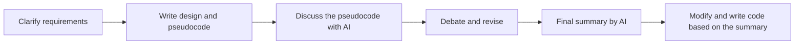
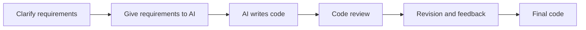

## Introduction

As AI continues to advance, the paradigm of programming is gradually changing. From the perspective of a solo developer who no longer develops professionally but still keeps building things, I see this change very positively.

Still, I think AI remains risky.

Sometimes it fails to infer exactly what I want, even when I was not clear about it myself and the result was only natural. There is still a psychological expectation that AI should somehow figure things out on its own.

Other times, its answers are too verbose or too brief, making them uncomfortable to read.

Even so, the efficiency AI provides is too large to ignore. I am also using AI in more varied ways, and the share of my development process handled with AI keeps increasing.

At the same time, I started thinking about how to avoid falling behind AI, how to avoid losing my own direction, and how to keep enjoying the convenience AI provides. This is partly for people who feel they must keep running like the Red Queen just to keep up, and partly for myself: someone who is not a professional developer anymore, but still loves writing code and does not want to fall behind those who are.

## How My Development Process Has Changed

Until a few months ago, I approached development very conservatively. I used AI for most frontend work, because I do not particularly enjoy frontend work, but I wrote most backend code by hand.

That does not mean I did not use AI at all. Before writing code, I would discuss the design and implementation plan with AI, then adapt the output into something I could use.



That was how I used to develop.

Given the nature of early-stage development, where many new models are created, I still think this was a good approach. I even handled simple repetitive work myself. For domain model classes, repositories, and other forms I used often, I kept code snippets and reused them.

These days, my process is changing little by little. I give AI the requirements and clear rules, let it write the code, and then review what it produced.



There are already many resources online about how to give clear requirements, and code review is something many developers already do at work. So in this article, I want to focus on my experience with the rules I give AI and the way I help it write code that is easier for me to read.

## What Cannot Be Delegated to AI

I think the most important thing for surviving in the age of AI is foundational knowledge.

By foundational knowledge, I do not only mean software knowledge such as algorithms, data structures, or framework usage.

What matters even more is clearly understanding the problem I am trying to solve, and understanding how the concepts inside that problem relate to one another.

1. A clear awareness of the problem I want to solve
2. Conceptual knowledge about that problem
3. An understanding of the solution

I believe these three are the most important elements.

The reason this foundational knowledge matters is that it allows me to clearly decide what to ask AI for, what kind of result should come out, and how to judge that result.

## How Should We Communicate with AI?

Recently, while "collaborating" with AI, I decided to apply DDD (Domain-Driven Design), which I have always liked, to the way I work with it. As I tried this, the concepts that felt important became clearer.

### Domain Knowledge

Suppose I want to implement simple genetic logic. More specifically, logic that calculates the probability of known primary mutations.

From the outside, the calculation itself looks simple. Enter the parents' genetic information, create possible combinations, and show the results as probabilities.

But when you try to implement it, the story changes a little. You need to distinguish concepts such as dominant, recessive, sex-linked inheritance, split, phenotype, and genotype. You also need to decide what names and structures will represent those concepts in code. If you want to add secondary mutations or crossover later, the design also needs room to expand.

At first, I thought that if I simply asked AI to design a `Mutation` model, it would handle things well. But when I discussed it with AI, I ran into quite a lot of friction.

The mutation inheritance system AI imagined was not a simple calculation. It dove deeply into gene loci and genetics knowledge, producing far more code than I needed and far more information than I could reasonably know.

The code looked plausible at first, but because I did not have much genetics knowledge, trying to understand it made me more confused. I could not easily judge whether the code was correct, excessive, or necessary.

So I looked up books about genetics, learned the basic concepts, and used those concepts to pick only what I actually needed.

In other words, `a clear awareness of the problem I want to solve and conceptual knowledge about it` allow me to ask AI for only what I need.

### Domain Language

In DDD, there is a concept called Ubiquitous Language.

It is one of the core ideas of DDD. When multiple people collaborate, they should communicate using the same conceptual system, and that language should be reflected in code, documents, and tests.

Imagine building a parrot breeding system.

If the code calls something `Bird`, conversations call it `parrot`, documents call it `individual`, and another context calls it `breeding stock`, then at some point each person starts translating terms into whatever word feels comfortable to them.

In our case, the Korean word `축사` caused confusion. In a parrot breeding center, there is an area that can be roughly understood as the "building" and another area made of "structures" that support cages and other equipment. But when we loosely called all of it `축사`, confusion kept happening.

So internally, we decided that `축사` means the building, while structures are called `facilities`.

### Standards

I think domain knowledge, language, and standards will become even more important in the age of AI.

When working on a project, everyone needs to look in the same direction to produce a good result. I do not think AI is an exception.

If we treat each AI session as a collaborator, then we need to align language with that collaborator and establish standards.

At first, I simply assumed AI would read my existing code and naturally follow the pattern, so I worked without giving it any standards. To be fair, it did write code that was somewhat similar to the existing patterns, and in most cases I was satisfied with the result.

But human desire never ends. I started feeling that the details were lacking. Sometimes AI created absurd abstractions. Other times it arbitrarily modified existing patterns and created new ones. Those results started to accumulate.

Eventually, I decided to establish project standards for AI.

```md
// AGENTS

### domain

- Handles models, value objects, and domain rules. Aggregates must extend [Aggregate](src/libs/ddd/aggregate.ts).
- Responsible for changing model state and publishing domain events. Events are published through `publishEvent()`.
- A domain folder may optionally contain `specs`, `services`, and `events` folders.

#### events

- Domain events are used when domain state changes, entities are created or deleted, or a side effect must occur because of an event.
- Domain events extend [DomainEvent](src/libs/ddd/event.ts).
- They are used inside the domain through `this.publishEvent()`.
- The event class id must be a uuid.

// pair.md

# Inbreeding coefficient

F=∑(1/2)n1​+n2​+1(1+FA​)

- F: inbreeding coefficient of the individual being calculated
- ∑: sum over all **common ancestors**
- n1​: number of generations from the common ancestor to the father
- n2​: number of generations from the common ancestor to the mother
- FA​: inbreeding coefficient of that common ancestor. If the ancestor is not inbred, this is 0.
```

In this way, I wrote down in `AGENTS.md` what each folder and concept is used for, and what kinds of content each should contain.

After organizing things like this and letting AI reference them, it started generating code much closer to the patterns I wanted. As a result, I no longer had to spend most of my review effort checking whether all the patterns were correct. I could focus more on the domain logic itself, which also made my own time and energy easier to use efficiently.

## Controlled Non-Determinism

As I started trusting AI little by little, the time I spent writing code decreased. That time could then be spent entirely on building domain knowledge and designing business logic.

This helped me build a higher-quality project. Good domain knowledge and good design eventually help AI produce better code, and they also help me develop the judgment to review and reject AI-written code accurately.

I still work on the project this way today, improving the standards whenever I find something that needs to be refined. It feels like onboarding a newly hired developer through documentation and guiding development in the direction I want: helping them understand where we are going so that we can move forward while looking in the same direction.

## Conclusion

Over the past few years, AI has advanced extremely quickly. Even so, I do not think AI has fully reached the realm of taste, or in other words, the realm of personalization. Of course, the ability to "just get it" is a slightly different topic, but that is still what we ultimately want, is it not?

The kind of developer I want to be, and the kind of developer I have wanted to be since I first started programming, has not changed.

1. Someone who knows what problem they are trying to solve
2. Someone who thinks about how that problem should be solved
3. Someone who knows why they solved it that way

I want to become that kind of developer. To do so, I am trying to collaborate with AI by communicating the domain knowledge I have in mind.

In the sea of AI, we still need a lighthouse. Building that lighthouse is not that difficult, so I hope more people try building one together.
