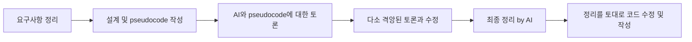
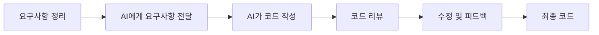

## 들어가며

AI가 발달되며 프로그래밍의 패러다임이 점점 바뀌고 있다. 이제는 개발을 업으로 삼지는 않지만, 개발을 계속 하고 있는 1인 개발자의 입장에서 이러한 변화는 굉장히 좋게 보고 있다.

하지만 여전히 내 생각에 AI는 아직도 리스크가 있다.

내가 원하는 작업을 알잘딱깔센 하지 못하는 경우도 종종 있고(나조차도 명확하게 모르기 때문에 그런 결과가 당연히 나왔음에도 불구하고 ai만큼은 알아서 해주기를 바라는 심리적인 부분이다),

가끔씩은 너무 장황하거나, 너무 간략해서 읽기가 불편한 경우도 있다.

그럼에도 AI가 주는 효율성이 너무나도 커서 이용하지 않을 수 없다. 나 역시도 점점 AI를 사용하는 방법을 다양화 하기도하면서 점점 더 AI를 사용하는 비중이 늘어가고 있다.

그러나 한편으로는 붉은 여왕처럼 달리지 않으면 뒤쳐진다라는 마인드를 가지고 있는 사람들, 그리고 직업 개발자가 아니면서도 그들에게 뒤쳐지기 싫어하는, 코드 치는 것을 사랑하는 나 자신을 위해 어떻게 하면 ai에게 밀리지 않고, 스스로의 방향을 잃지 않고, 그리고 AI의 편리함을 누릴 수 있을지에 대한 고민을 하게 되었다.

## 개발방식의 변화

몇달전까지만 해도 나는 개발에 대해서 아주 보수적인 방식의 접근을 했다. 프론트는 거의 ai를 통해 작업을 하면서(프론트는 작업하기 싫다..) 백엔드는 거의 수작업으로 코드를 작성했다.

물론 내가 아예 사용하지 않았다는 의미는 아니다. 코드를 작성하기 전 설계와 어떻게 작성할 지 ai와 토론을 거친 후 거기서 나온 결과물을 바탕으로 변형해서 사용했던 것 같다.



이런 방식으로 개발을 했었다.

물론 새로운 모델 개발이 많은 초기 개발 특성상 이것도 좋은방식이라고 생각한다. 여기서 단순작업들도 내가 직접했었다. 물론 자주 쓰는 형태의 도메인 모델 클래스, 레포지토리 등은 코드 스니펫을 만들어 놓고 사용했다.

요새는 조금씩 바뀌고 있다. ai에게 요구사항과 명확한 규칙들을 주고 AI가 짠 코드들을 내가 리뷰하는 방식으로 진행하고 있다.



요구사항을 명확하게 주는 방식이나 이런것들은 인터넷에 많기도하고 코드리뷰는 회사에서 많이 할테니 이번엔 어떤 규칙들을 주고 있는지, 어떤 방식으로 ai가 읽기 쉬운 코드를 짤 수 있게 하는지에 대한 경험을 위주로 공유해보려고 한다.

## AI에게 맡길 수 없는 것

ai시대에서 살아남기 위해 가장 중요한 것은 기본 지식이라고 생각한다.

여기서 말하는 기본 지식은 단순히 알고리즘, 자료구조, 프레임워크 사용법 같은 소프트웨어 지식만을 의미하지 않는다.
오히려 더 중요한 것은 내가 해결하려는 문제가 어떤 것인지 명확하게 알고, 그 문제 안에서 개념들이 서로 어떤 관계를 맺고 있는지 아는 것이다.

1. 내가 해결하고자 하는 문제에 대한 명확한 인식
2. 내가 해결하고자 하는 문제에 대한 개념적인 지식
3. 해결 방법에 대한 이해

이 3가지가 가장 중요한 요소라고 생각한다.

이러한 기본 지식이 중요하다고 생각하는 이유는 AI에게 무엇을 요구할 것인지, 어떤 결과가 나와야 할 것인지, 그 결과물을 어떻게 판단할 것인지를 명확하게 해줄 수 있기 때문이다.

## 어떻게 AI와 소통할 것인가?

최근에 AI와 '협업'을 하면서 내가 좋아하는 DDD(Domain-Driven Design)를 협업하는 방식에 적용해보기로 했다. 적용해보면서 중요하다고 생각하는 개념들이 좁혀졌던 것 같다.

### 도메인 지식

간단한 유전 로직을 구현하려고 한다. 알려진 1차적인 돌연변이가 발생할 확률을 구하는 로직이다.

겉으로 보면 계산 자체는 단순해 보인다. 부모의 유전 정보를 입력하고, 가능한 조합을 만들고, 그 결과를 확률로 보여주면 된다.

하지만 실제로 구현하려고 하면 이야기가 조금 달라진다. 우성, 열성, 반성 유전, 스플릿, 표현형, 유전자형 같은 개념을 구분해야 하고, 이 개념들이 코드 안에서 어떤 이름과 구조로 표현될지도 결정해야 한다. 여기서 추가로 2차 돌연변이, 크로스 오버 같은 개념을 추가하기위해서는 확장성 있게 설계해야 한다.

처음에 AI에게 간단하게 Mutation 모델 설계하라고 하면 알아서 잘 해줄 것 같았지만, AI와 토론할 때 꽤 많은 고난을 겪어야했다.

AI가 생각하는 돌연변이 유전 체계는 간단한 계산이 아닌 유전자 자리나 유전학 관련된 지식을 굉장히 깊이 있게 다루면서 내가 필요한 것 보다, 내가 알 수 있는 정보의 양보다 더 엄청난 코드들이 만들어진다.

처음 볼 때 코드는 그럴듯 했지만 내가 유전학 관련된 지식이 별로 없어서 코드를 이해하려고 하다보니 오히려 더 혼란스러웠다. 그 코드가 맞는지, 과한지, 필요한지 판단하기 어려웠다.

그래서 유전학 관련된 책들을 찾아보면서 기본적인 개념을 익히고, 그 개념을 바탕으로 나에게 필요한 것들만을 골라낼 수 있었다.

즉, `내가 해결하고자 하는 문제에 대한 명확한 인식, 개념적인 지식`이 AI에게 더욱 내가 필요한 것만 요청할 수 있게 해주는 것이다.

### 도메인 언어

DDD에서 Ubiquitous Language라는 개념이 있다.

이 개념은 DDD의 핵심 개념 중 하나로, 여러명의 사람들이 협업을 할 때 같은 개념 체계로 대화하고, 그 언어가 코드·문서·테스트에 반영 되어야 한다는 개념이다.

앵무새 브리딩 시스템을 다룬다고 생각해보자.

코드에서는 `Bird`, 대화에서는 `앵무새`, 문서에서는 `개체`, 또는 `종조`와 같은 각기 다른 언어로 부른다면 어느순간 대화할 때 각자 편한 단어로 번역을 해서 생각하는 경우가 생긴다.

실제로 `축사`라는 단어가 우리에게는 혼동이 왔었다. 앵무새 브리딩 센터의 경우 쉽게 구분해봤을 때 '건물'의 영역과 새장 등을 받치고 있는 '구조물'의 영역이 있는데, 이를 두고 축사로 퉁쳐서 부르다보니 계속해서 혼란이 왔었다.

그래서 내부적으로 `축사`는 건물이라는 의미로, 구조물은 `시설`이라는 단어로 통일하기로 했다.

### 기준

내가 생각하는 AI 시대에는 이러한 도메인 지식, 언어, 기준이 더욱 중요해질 것 같다.

하나의 프로젝트를 할때는 모두가 같은 방향을 바라보며 협업을 해야 좋은 결과물을 얻을 수 있다. AI도 예외는 아니라고 생각한다.

AI의 세션을 하나의 협업자로 보면, 협업자와 언어를 맞추고 기준을 세우는 것이다.

처음에는 내가 쓴 코드들을 읽고 알아서 패턴에 맞추겠거니 하고 아무런 기준 없이 진행했다. 물론 어느정도 기존의 패턴과 비슷하게 짜기도 하고 대부분의 경우 결과물이 만족스러웠다.

하지만 항상 사람의 욕심은 끝이없다. 디테일이 부족하다고 생각했다. 어떨 때는 정말 말도안되는 추상화를, 어떨 때는 기존 패턴에서 자기 임의대로 변형을 해서 새로운 패턴을 만들어내는 등의 결과물이 조금씩 누적됐다.

결국 나는 AI에게 프로젝트의 기준을 세우기로 했다.

```md
// AGENTS

### domain

- 모델, 값 객체, 도메인 규칙을 담당한다. Aggregate의 경우 [Aggregate](src/libs/ddd/aggregate.ts)를 상속해야한다.
- 모델의 상태 변경을 책임지고 도메인 이벤트의 발행을 책임진다. 이벤트 발행의 경우 `publishEvent()` 통해 발행한다.
- 도메인 폴더 아래에는 `specs`, `services`, `events` 폴더를 선택적으로 가질 수 있다.

#### events

- 도메인 이벤트는 도메인의 상태가 변경되거나 생성되거나 삭제되는 등, 이벤트로 인해 사이드 이펙트가 생겨야 하는 경우 사용한다.
- 도메인 이벤트는 [DomainEvent](src/libs/ddd/event.ts)를 상속한다.
- 도메인 내부에서 `this.publishEvent()`를 통해 사용한다.
- 이벤트 클래스의 id는 uuid로 한다.

// pair.md

# 근친계수

F=∑(1/2)n1​+n2​+1(1+FA​)

- F: 계산하려는 개인의 근친계수
- ∑: 모든 **공통 조상(common ancestor)** 에 대해 더함
- n1​: 공통 조상으로부터 아버지까지의 세대 수
- n2​: 공통 조상으로부터 어머니까지의 세대 수
- FA​: 해당 공통 조상의 근친계수 (만약 그 조상이 근친이 아닐 경우 0)
```

이런식으로 각 폴더, 개념이 어떤 경우에 사용하는지, 어떤 내용을 포함하고 있어야 되는지에 대해 `AGENTS.md`에 정리해두었다.

이런식으로 정리하고 나서 ai가 참조하게 한 뒤로 이전보다 내가 원하는 패턴대로 코드를 생성하고 이를 통해 나 역시 기존에 거의 모든 패턴을 제대로 짰나 등을 보기 보다는 도메인 로직에만 리뷰를 집중하게 될 수 있게 되면서 나의 리소스 또한 효율적으로 사용할 수 있게 되었다.

## 통제된 비결정성

AI를 조금씩 더 신뢰하게 되면서 나는 코드를 작성하는 시간은 줄어들고, 이러한 시간들은 온전히 내가 도메인 지식을 쌓고, 비즈니스 로직을 설계하는 데에 집중할 수 있게 되었다.
그러면서 더 질 좋은 프로젝트를 만들 수 있게 되었고, 좋은 도메인 지식, 설계는 결국 AI가 더 좋은 코드를 만들 수 있도록 도와주고, AI가 짠 코드를 정확하게 리뷰하고 거절할 수 있는 판단력을 기를 수 있게 되었다.

현재에도 이러한 방식으로 프로젝트를 진행하고 있고, 보완할 곳이 생길 때마다 수정하면서 하고 있다. 마치 AI를 신규 입사한 개발자처럼 문서를 통해 온보딩을 하면서 내가 원하는 방향으로 개발을 이끌어 간다는 느낌처럼, 그들에게 우리가 가는 방향에 대해 이해시키고, 같은 방향을 바라보며 나아가길 바란다.

## 마무리

지난 몇년 간 AI는 굉장히 빠르게 발전해왔다. 다만, AI는 아직까지 취향의 영역, 즉 개인화의 영역까지 도달하지는 못한 것 같다.(물론 알잘딱깔센의 영역은 좀 다른 이야기지만 그럼에도 우리가 원하는 건 그런 것이지 않은가?)

내가 생각하는, 그리고 내가 되고자 하는 개발자는 내가 개발을 처음 시작할 때부터 생각이 변함이 없다.

1. 어떤 문제를 해결하고자 하는지 아는
2. 그 문제를 어떻게 해결해야 할 지 고민하는
3. 그리고 해결 했을 때 왜 이렇게 했는지 아는

그러한 개발자가 되고 싶다. 그러기 위해서 내가 생각하는 도메인 지식을 AI에게 전달하는 방식으로 AI와 협업하며 노력해보고 있다.

AI의 바다에선 아직 등대가 필요하다. 그 등대를 세우는 것은 그리 어렵지 않으니 여러분들도 함께 만들어 보면 좋겠다.
