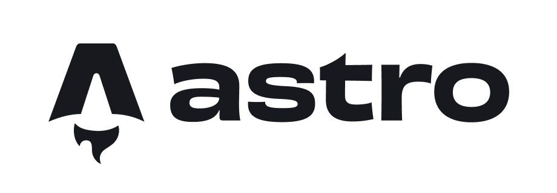
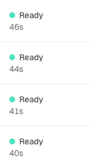
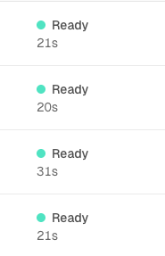

import svelteLogo from "../assets/astro-amaze-amaze-amaze/svelte-logo.png";
import pageSpeedResult from "../assets/astro-amaze-amaze-amaze/page-speed-result.png";

## 들어가며

최근에 `프로젝트 헤일메리`를 아주 재미있게 봤다. 프로젝트 헤일메리에서는 항성의 에너지를 흡수하여 질량으로 저장하고, 그 질량을 에너지로 전환하여 엄청나게 빠른 속도로 이동하는 **아스트로파지** 라는 미생물이 있다.

프로젝트 헤일메리를 영화관에서 2번 봤는데(한 번은 아이맥스에서 봤다.) 집에서 다시 생각해보니 '내 테크블로그가 Astro로 만들어져 있는데 이걸 주제로 글을 안 썼네?' 라는 생각이 들었다.

그래서 한번 써보려고 한다. 내가 왜 테크 블로그를 나누었고, 왜 테크 블로그의 기술 스택으로 아스트로를 사용했는지를.

## 브리딩 센터가 테크블로그?

나는 앵무새 브리딩 센터를 운영하지만, 동시에 개발자이기도 하다. 그래서 내가 만들고 있는 것들, 고민했던 기술 스택, 시행착오를 별도의 기록으로 남기고 싶었다.

조금 더 자세히 이야기를 풀어보자면 "[기록, 좌표, 그리고 방향: 우리가 기술을 기록하는 이유](record-coordinate-direction)"을 보면 좋을 것 같다.

처음 웹페이지를 만들었을 때 [브리딩 홈페이지](https://naviary.io)에 블로그 메뉴에 앵무새 가이드와 테크를 엔드포인트로 나눠놨었다.

그게 제일 간단한 방법이기도 하고 당연히 나의 고객이 될 사람들에게 내가 어떤식으로 하고 있는지를 보여주는게 좋지 않을까 해서 가장 접근성이 좋을 홈페이지에 두었다.

다만, 점점 블로그 글을 작성하면서 브리딩 관련된 포스팅과 테크 관련된 포스팅을 분리해서 생각하는게 맞지 않을까라는 생각이 들었다.

앵무새 가이드를 찾는 사람과 기술 글을 읽는 사람은 목적이 다르다. 두 개의 다른 맥락을 한 공간에 두게 되면 양쪽 모두의 UX가 흐려질 수 있다고 판단했다. 그리고 기존 페이지에선 블로그 글을 읽기까지의 depth가 하나씩 추가되어 ux적으로 불편함이 있었다.

## 기술스택 고르기

나는 항상 새로운 프로젝트를 하게 되면 기술스택을 검토한다. 물론 익숙하고 안정적인 기술스택을 고르는 방식도 있지만, 항상 최선의 기술스택을 고르고 싶은 마음이 조금 더 큰 것 같다.

테크 블로그는 애초에 목표가 확실했다.

> 화려하지 않고 깔끔하게 경량으로 사이트로 만들어서 사용자에게 정보를 정확하고 신속하게 전달하는 것.

처음에 고려했던 기술스택들은 꽤 많았던 것 같다.

1. Next.js
2. SvelteKit
3. Gatsby
4. Astro

그 외에도 뭐 Hugo라던지 그런것들이 있긴 했지만 주로 생각했던 것은 저 4개 였던 것 같다.

### 1. Next.js


가장 먼저 떠오른건 역시 Next.js였다. 프론트엔드 생태계에서 최근들어 거의 표준이 되었다고 해도 무방할 정도로 많이 쓰이고 있고, 나 역시도 기존 브리딩 홈페이지가 Next.js로 만들어져있고 React 기반으로 프론트 작업을 하던 나에게 가장 익숙한 도구였다.

물론 기능도 많고 지원해주는 부분도 많아 편리한 부분이 있다. 다만, 테크 블로그의 경우 기존 홈페이지와는 다르게 인터랙션도 없고 그냥 포스팅만 할 용도였기 때문에 그렇게 많은 기능이 필요하진 않았다.

단순히 마크다운으로 작성된 글을 깔끔하고 빠르게 보여주기만 하면 되는 테크 블로그 특성상 Next.js는 조금 느리고 무겁다고 생각했다. 그래서 다른 대안을 찾아봤었다.

```typescript
export default async function ArticlePage({ params }: { params: { slug: string } }) {
  const filePath = path.join(process.cwd(), 'src/content', `${params.slug}.mdx`);
  const source = await fs.readFile(filePath, 'utf8');

  const { content, frontmatter } = await compileMDX<{ title: string }>({
    source,
    options: { parseFrontmatter: true }
  });

  return (
    <article>
      <h1>{frontmatter.title}</h1>
      {content}
    </article>
  );
}
```

<div className="flex flex-col items-center justify-center text-center">
  <span className="text-sm text-[hsl(215,15%,50%)] italic">
    Next.js 예제 코드 파일 경로를 찾아 외부 라이브러리를 사용하여 마크다운을 그린다.
  </span>
</div>

### 2. SvelteKit

<div className="my-8 flex justify-center">
  
</div>

Next.json보다 가벼운 프레임워크가 없을까 라고 생각했을때 바로 생각난 프레임워크가 svelte 기반의 SSR/SSG 프레임워크인 SvelteKit 이었다. 코드도 간단하고 next에 비하면 꽤 가벼운 프레임워크이기 때문에 next가 무겁다고 생각했을때 바로 생각났었다.

내가 원하는 것을 생각했을때 나는 그냥 정적 사이트면 된다고 생각했는데 스벨트도 그런의미에서는 조금 어플리케이션 중심의 프레임워크가 아닌가? 라는 생각이 들었다.

그래서 SSG 위주로 다시 생각해보기로 했다.

```svelte
<script>
  export let data;
</script>

<article>
  <h1>{data.frontmatter.title}</h1>
  <svelte:component this={data.content} />
</article>
```

<div className="flex flex-col items-center justify-center text-center">
  <span className="text-sm text-[hsl(215,15%,50%)] italic">svelte 예제 코드 코드가 간결하다.</span>
</div>

### 3. Gatsby


정적 사이트 프레임워크 중에서 아마 가장 유명하지 않을까 생각된다. 리액트 기반이고 특이하게도 데이터 처리로 GraphQL을 사용한다.

개인적으로 리액트인건 마음에 들었다. 아무래도 기존에 가장 잘 사용하던 것이기때문에 익숙했다. 하지만 GraphQL은 조금 달랐다. gatsby에서는 마크다운 파일을 가져올 때 GraphQL 데이터 레이어로 모아서 관리해야한다고 한다.

기존에 GraphQL의 사용경험이 별로 좋지 않았기 때문에 꺼리게 되었다.

```typescript
export default function BlogPost({ data }) {
  const post = data.mdx
  return (
    <article>
      <h1>{post.frontmatter.title}</h1>
      <MDXRenderer>{post.body}</MDXRenderer>
    </article>
  )
}

export const query = Graphql`
  query($slug: String!) {
    mdx(fields: { slug: { eq: $slug } }) {
      body
      frontmatter {
        title
      }
    }
  }
`
```

<div className="flex flex-col items-center justify-center text-center">
  <span className="text-sm text-[hsl(215,15%,50%)] italic">
    gatsby 예제 코드 Graphql을 사용하여 데이터를 불러온다.
  </span>
</div>

### 4. Astro



Astro는 이번에 테크블로그를 새로 만들게 되면서 처음 알게된 프레임워크였다. 컨셉이 확실했다.

JavaScript 최소화, 콘텐츠 컬렉션, 필요한 곳에만 적용되는 아일랜드 아키텍처 등 뭔가 내가 좋아보인다고 생각하던 것들이 담겨져 있었다.

그래서 선택했다.

```astro
---
import { getCollection, render } from 'astro:content';

const posts = await getCollection('blog');
const post = posts.find((p) => p.slug === Astro.params.slug);
const { Content } = await render(post);
---

<article>
  <h1>{post.data.title}</h1>
  <Content />
</article>
```

<div className="flex flex-col items-center justify-center text-center">
  <span className="text-sm text-[hsl(215,15%,50%)] italic">astro 예제 코드</span>
</div>

## 그래서 뭐가 좋은데?

### 자바스크립트 최소화

Astro를 선택하면서 가장 마음에 들었던 점이었다. 기본적으로 Astro는 JavaScript를 최소화하여 페이지를 정적인 HTML로 먼저 만들고, 정말 인터렉션이 필요한 부분에만 Javascript를 붙이는 방식으로 동작한다.

테크 블로그는 글을 읽는 공간이다. 사용자가 글을 읽기 위해 불필요한 점은 모두 없애는게 좋다고 생각했다. React나 Next를 선택하지 않은 이유도 가끔은 이런 번들을 받는 시간이 불편하게 생각될 때가 있어서 선택하지 않았다.

내려받을 번들이 없으니 더욱 빠르게 랜더링이 되고, HTML을 기본적으로 내려주기 때문에 SEO면에서도 유리하다.

사용자 측면에서 이런 부분이 더 좋다고 생각했다. 물론 필요한 부분에서는 JavaScript를 사용할 수 있기 때문에 기술적인 문제는 전혀 없다.

### 의존성

개인적인 사용 경험에서 일단 외부 의존성이 없이 운영하기 편하다는 것이었다. 물론 외부 의존성이 아예없는 것은 아니다.

나의 경우 `tailwindcss`가 외부 의존성으로 들어가있다. 아무래도.. 거의 모든 프로젝트에서 tailwind를 사용하다보니 이제는 그냥 css보단 tailwind를 사용하는 것이 더 편한 몸이 되어버렸다.

### 빌드속도

빌드 속도 역시 매우 빨라졌다. 기존 브리딩센터 배포의 경우 평균 40초정도 걸린 반면, astro로 하는 경우 평균적으로 20초 초반대가 걸린다.

<div className="flex items-center justify-center gap-2">
  <div></div>
  <div></div>
</div>

<div className="flex flex-col items-center justify-center text-center">
  <span className="text-sm text-[hsl(215,15%,50%)] italic">
    next.js 배포 시간 / astro 배포 시간
  </span>
</div>

### Content Collection

Astro에는 Content Collection이라는 기능이 있다.

MDX파일들을 불러오면서 프론트매터 데이터 타입을 검증한다. 블로그 글을 작성하다보면 가끔 실수할때가 있는데 개발 단계에서 쉽게 알 수 있다.

Astro에서 내장된 Zod를 이용하여 config 파일에 정의만 해두면 빌드타임에 알아서 에러를 뱉어내며 알려준다.

```typescript
import { defineCollection } from "astro:content";
import { glob } from 'astro/loaders'
import { z } from 'astro/zod'

const schema = ({ image }: { image: (opts?: { inferSize?: boolean }) => any }) => z.object({
  // basic information
  title: z.string(),
  description: z.string(),
  author: z.string().default("Naviary"),

  ...
})

const koBlog = defineCollection({
  loader: glob({ pattern: '**/[^_]*.{md,mdx}', base: "./src/content/ko" }),
  schema,
})

const enBlog = defineCollection({
  loader: glob({ pattern: '**/[^_]*.{md,mdx}', base: "./src/content/en" }),
  schema,
})

export const collections = { koBlog, enBlog }
```

<div className="flex flex-col items-center justify-center text-center">
  <span className="text-sm text-[hsl(215,15%,50%)] italic">content.config.ts</span>
  <span className="text-sm text-[hsl(215,15%,50%)] italic">
    glob pattern으로 블로그로 사용할 컨텐츠의 위치를 정할 수 있다.
  </span>
</div>

### 다국어 지원

현재 테크 블로그는 영어와 한국어 두 가지 언어로 게시되어있다. 다국어 라우팅 역시 잘 지원해주는 편이라고 생각한다.

이 역시 Astro config 파일에 몇줄 추가만 해준다면 라우팅 지원이 된다. 아주 쉽게 할 수 있기 때문에 좋은 것 같다.

```mjs
export default defineConfig({
  ...
  i18n: {
    defaultLocale: 'ko',
    locales: ['ko', 'en'],
    routing: {
      prefixDefaultLocale: true,
      strategy: "prefix",
    },
  }
});
```

<div className="flex flex-col items-center justify-center text-center">
  <span className="text-sm text-[hsl(215,15%,50%)] italic">astro.config.mjs</span>
  <span className="text-sm text-[hsl(215,15%,50%)] italic">다국어 설정이 매우 쉽다.</span>
</div>

## 단점은?

물론 단점도 있다.

### 익숙하지 않은 문법

필자는 일단 React의 JSX 문법에 절여져 있다. 그렇다보니 오랜만에 표준 HTML과 같은 문법을 사용하려니 굉장히 익숙치 않았던 것 같다.

그리고 astro에서는 MDX의 프론트매터처럼 파일 최상단에 `---`로 구분된 스크립트 로직을 사용할 수 있다.

```astro
---
// 여기서 Props interface를 선언하면 실제 해당 컴포넌트가 받는 props로 정의가 된다.
interface Props {
  title?: string;
  description?: string;
}

const { title, description } = Astro.props
---

// 그 후 렌더링 문법.
<div>{title} : {description}</div>
```

적응하면 꽤 직관적이고 편하다고 생각된다. 다만, React에 절여져 있다보니 당황하고 불편하게 보이는 면도 있다.

### 스크립트 적용의 어려움

다시 한번 말해보자면, 난 React에 절여져있다. html에 쓰이는 script 역시도 쓴지 굉장히 오래되었다.

그래서 이번에 테크 블로그를 만들면서 모바일 화면의 메뉴버튼이라던가, 아티클을 읽을 때 현재 목차 리스트에서 내가 읽고 있는 부분을 표시해주는 거라던가 등의 로직을 작성할 때 어려움을 겪었다.

물론 AI의 도움도 받기는 했지만 나는 AI가 쓴 코드는 내가 이해하지 못하면 적용하지 않는다. 그래서 오랜만에 `querySelector`, `addEventListener` 같은 것들을 본 것 같다.

확실히.. 오랜만에 보니 익숙하지 않아 보는데 시간이 좀 걸렸던 것 같다.

## 마무리

<div className="my-8 flex justify-center">
  
</div>

<div className="flex flex-col items-center justify-center text-center">
  <span className="text-sm text-[hsl(215,15%,50%)] italic">
    page speed 측정. 모바일은 80점대 중반이 나온다
  </span>
</div>

Astro로 블로그를 만들며 바닐라 자바스크립트 사용에 잠시 당황하긴 했지만, 기본기를 다지고 그만큼 좋은 퍼포먼스를 내게되어 아주 만족스러웠다.

결국 Astro를 사용하면서 SEO나 접근성 영역에서 기존의 툴보다 더 나은 결과물을 냈다고 생각하고 특히 배포 속도나 접속했을때 속도를 보면 꽤나 뿌듯하다.

현재 테크블로그의 경우 github에 오픈소스로 공개되어 있다. 필요하면 언제든 [소스코드](https://github.com/Naviary-Sanctuary/tech-blog)를 가져가도 된다.

목적지에 도달하기 위해 아스트로파지를 연료로 썼던 헤일메리호처럼, Astro를 도입하며 다진 기본기가 나비어리가 나아가는 여정에 좋은 연료가 되었으면 한다.

마지막으로 영화 속 로키의 표현을 빌려 글을 마친다.

**Astro. 좋음, 좋음, 좋음👎**
